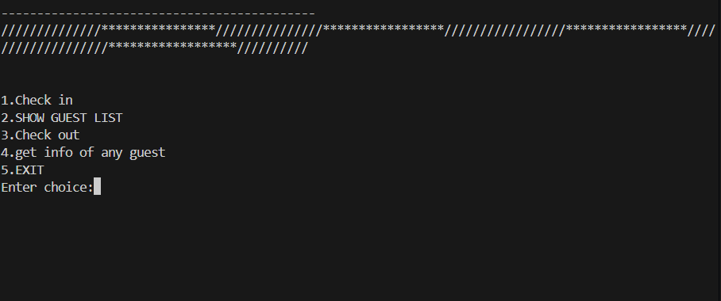
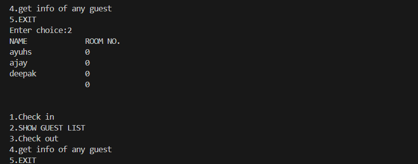

# Hotel Management System

## 📷 Screenshots

A comprehensive hotel management system built with Python and Tkinter GUI. This system provides essential features for managing hotel operations including check-in, check-out, room management, and guest information tracking.

## Features

1. **Check-in System**

   - Guest registration with name, address, and contact details
   - Room type selection (Deluxe, Semi-Deluxe, General, Joint Room)
   - Payment options (Cash/Card with 10% discount on card payment)
   - Automatic room allocation
   - Bill generation with complete details

2. **Check-out System**

   - Room number based checkout
   - Automatic guest record removal
   - Farewell message generation

3. **Guest List Management**

   - View all current guests
   - Display of guest names and room numbers
   - Real-time list updates

4. **Guest Information Retrieval**

   - Room number based information lookup
   - Display complete guest details including:
     - Name
     - Address
     - Mobile number
     - Room number
     - Total bill

5. **Room Categories**
   - Deluxe Rooms (1-10)
   - Semi-Deluxe Rooms (11-25)
   - General Rooms (26-45)
   - Joint Rooms (46-50)

## File Structure

- `main.py` - The main command-line interface of the system
- `mainly.py` - The main GUI interface of the system
- `checkin_gui_and_program.py` - Check-in interface and functionality
- `checkoutgui.py` - Check-out interface and functionality
- `listgui.py` - Guest list display interface
- `getinfoui.py` - Guest information retrieval interface
- `recipt.py` - Receipt generation functionality
- `hotel.dat` - Data storage file
- `recipt.txt` - Temporary receipt storage

## Room Rates (Per Day)

- Deluxe Room: ₹2000
- Semi-Deluxe Room: ₹1500
- General Room: ₹1000
- Joint Room: ₹1700

## How to Use

1. Run `mainly.py` to start the hotel management system
2. Use the main menu to access different features:
   - Check-in new guests
   - View guest list
   - Process check-outs
   - Retrieve guest information
   - Exit the system

## Dependencies

- Python 3.x
- Tkinter (Python's standard GUI library)
- Pickle (for data persistence)

## Data Storage

The system uses binary file storage (`hotel.dat`) to maintain guest records using Python's pickle module. This file:

- Is created automatically when the first guest checks in
- Stores data in binary format to ensure data integrity
- Gets updated during check-in (appending new records) and check-out (removing records)
- Is used for all guest-related operations (listing, information retrieval)

Each record in `hotel.dat` contains the following guest information:

- Guest name
- Address
- Mobile number
- Room number
- Total bill

Note: If `hotel.dat` is corrupted or deleted, the system will automatically create a new one, but previous guest records will be lost. It's recommended to regularly backup this file.

## Notes

- The system automatically handles room allocation
- 10% discount is provided on card payments
- Data is persistently stored and retrieved using pickle
- GUI is built using Tkinter for ease of use
